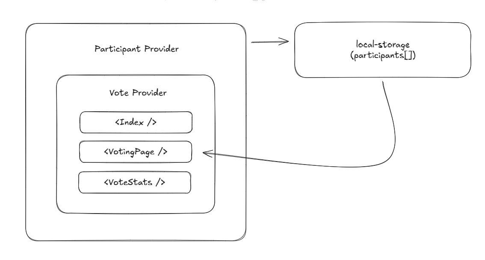
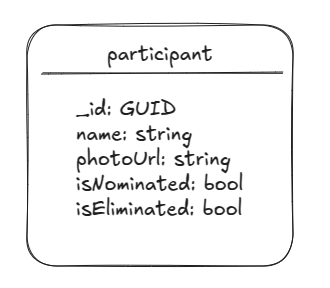
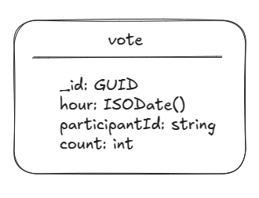

# decidr-app

Aplicativo de sistema de votação com alta volumetria esperada. O objetivo aqui foi o de realizar uma API de votação simulando um dos ciclos de eliminação, inspirado no modelo utilizado pelo Big Brother Brasil.

## Executando localmente

### Pré-requisitos

O pré requisito mínimo para _execução_ dessa aplicação é o `Docker` que pode ser instalado [aqui](https://docs.docker.com/)

Execute `docker compose up -d` no seu terminal, o front-end estara exposto em `http://localhost:5173` e o backend em `http://localhost:8080`

Ja para desenvolvimento é necessário realizar a instalação da linguagem de programação `Go` e do gerenciador de pacotes `Node.js 22`

## Implementações e tecnologias

O front-end da aplicação foi criado utilizando a tríade `React.js` + `Vite` + `TailwindCSS`.
O back-end foi criado uma APIRest utilizando Go-lang com a biblioteca `gin` por sua integração simples com Prometheus e parseamento de jsons.
Para persistência foi utilizado o banco MongoDB.

Também foi implementada a observabilidade do sistema utilizando `OpenTelemetry` + `Loki`, além do supracitado `Prometheus` pra exposição de métricas, as quais podem ser visualizadas via `Grafana`.

### Arquitetura da aplicação

#### Front-end

Para o front-end foi utilizada a arquitetura Context-API, apesar da aplicação não demonstrar muita complexidade, existiam informações que permeariam mais de um componente, como informações sobre status da votação (se o usuário já votou ou não), o array de participantes, etc. Entao, Context-API foi a abordagem escolhida para evitar _prop drilling_ entre os componentes da aplicação.



Como é possível ver no diagrama, temos um _ParticipantProvider_ para as informações de participantes que as armazena na cache local do usuário para evitar múltiplas requisições à API e as reutiliza para todas as páginas, já o _VoteProvider_ fica responsável pelo controle de fluxo de votação e armazenamento do valor booleano `hasVoted`, responsável por exibir o formulário da votação ou o percentual de votos em cada participante.

#### Back-end

##### Escolhas arquiteturais

Para o back-end a arquitetura utilizada foi o padrão `Handler - Service - Repository`. Pelo escopo pequeno da API não foi necessário fazê-la _feature-based_, portanto, os arquivos associados aos Handlers, Serviços, etc. foram reunidos nas mesmas pastas.

```sh
.
├── entities
│   ├── participant.go
│   ├── voteRequest.go
│   └── voteResult.go
├── handlers
│   ├── participant_handler.go
│   └── vote_handler.go
├── http
│   └── router.go
├── infra
│   └── mongo
│       ├── connection.go
│       └── migrations
│           └── seed_participants.go
├── repositories
│   ├── participant_repository.go
│   └── vote_repository.go
└── services
    ├── participant_service.go
    └── vote_service.go
```

##### Governança

Para armazenamento dos dados foram disponibilizadas duas _collections_ no mongoDb, uma para armazenamento dos participantes, a qual seria populada a cada inicio de aplicação com base em uma estrutura de dados previamente montada inspirada nos participantes da edição 25 do Big Brother Brasil da seguinte forma:



Já, para armazenamento dos dados de votação foi disponibilizada uma collection com documentos criados por hora e com abordagem de um contador incremental para garantir atomicidade dos votos, a entidade de voto segue o seguinte modelo no banco:



O racional dessa estrutura foi para possibilitar a criação de histogramas e storytelling envolvendo os votos por hora a partir de agregações no mongoDb, seguindo a seguinte formatação:

> Request para /api/results

```json
[
    {
        "participant_id": "6818258b1382e5f2fbc254b1",
        "count": 51527
    },
    {
        "participant_id": "6818258b1382e5f2fbc254ba",
        "count": 51670
    },
    {
        "participant_id": "6818258b1382e5f2fbc254b9",
        "count": 51665
    }
]
```

> Request para /api/results?byHour=true

```json
[
    {
        "participant_id": "6818258b1382e5f2fbc254b9",
        "count": 25165,
        "hour": "2025-05-05T03:00:00Z"
    },
    {
        "participant_id": "6818258b1382e5f2fbc254b1",
        "count": 24874,
        "hour": "2025-05-05T03:00:00Z"
    },
    {
        "participant_id": "6818258b1382e5f2fbc254ba",
        "count": 24963,
        "hour": "2025-05-05T03:00:00Z"
    },
    {
        "participant_id": "6818258b1382e5f2fbc254b1",
        "count": 26653,
        "hour": "2025-05-05T04:00:00Z"
    },
    {
        "participant_id": "6818258b1382e5f2fbc254b9",
        "count": 26500,
        "hour": "2025-05-05T04:00:00Z"
    },
    {
        "participant_id": "6818258b1382e5f2fbc254ba",
        "count": 26707,
        "hour": "2025-05-05T04:00:00Z"
    }
]
```

Com essa abordagem é possível que o front-end realize implementações de filtro com menor complexidade e maior possibilidade de manipulação das informações da votação.
